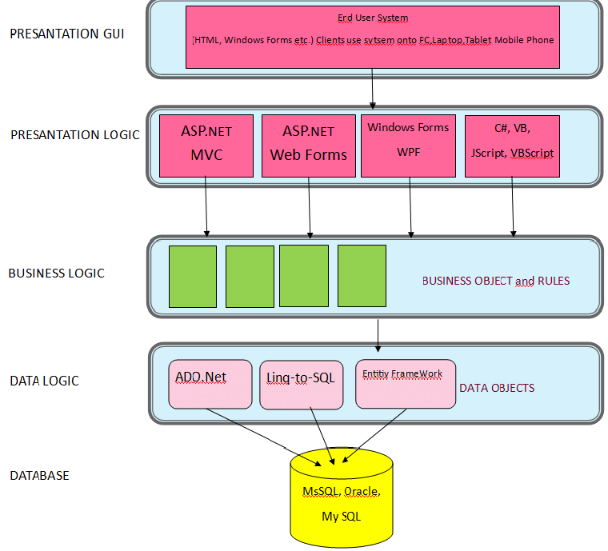

# Architecture Models

## Multi-Tier (N-tier) Model

N-tier architecture is a client-server architecture concept in software engineering where the presentation, processing and data management functions are both logically and physically separated

N-Tier Architecture is preferred because of the reasons such as easy project management, well suited to teamwork and effective fault management. The developed program consists of Data, Data Logic, Business Logic, Presentation Logic and Presentation GUI layers .