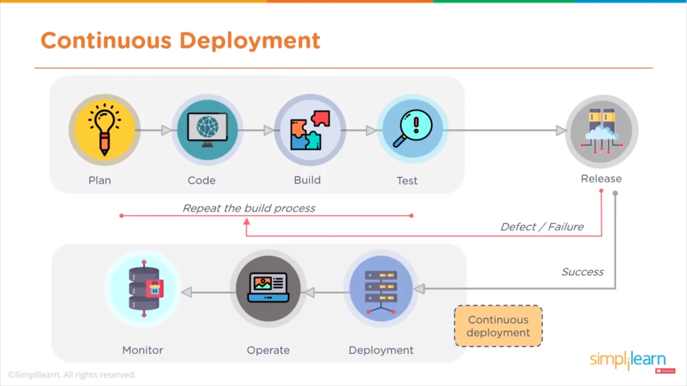

# DevOps

DevOps is the combination of cultural philosophies, practices, and tools that increases an organization’s ability to deliver applications and services at high velocity: evolving and improving products at a faster pace than organizations using traditional software development and infrastructure management processes. This speed enables organizations to better serve their customers and compete more effectively in the market. 

DevOps emphasizes better collaboration and efficiencies so teams can innovate faster and deliver higher value to businesses and customers.

DevOps is short for Development (Dev) and Operations (Ops). Dev are the people and processes that create software. Ops are the teams and processes that deliver and monitor the software. 

DevOps brings together formerly siloed roles (development, IT operations, quality engineering, and security) to optimize the productivity of developers and the reliability of operations.

## Problems with Traditional Development Practices

1. Monolithic applications are hard to update and deploy because they:

- Are developed and deployed as a unit, so when changes are made, the entire application must be redeployed
- Have tightly coupled functionality, so if the application is large enough, maintenance becomes an issue - because developers have a hard time understanding the entire application
- Are implemented using a single development stack, so changing technology is difficult and costly

2. Manual processes throughout the application lifecycle are slow, inconsistent, and error-prone. For example, manually setting and configuring the infrastructure is time-consuming. Manually repeating this process is no guarantee that a step will not be missed. Another example is telling the developers to make sure their code is thoroughly tested before pushing it. Even with the best intentions, this manual process is slow, and does not preclude someone from forgetting a test or two.

3. Teams supporting the software development lifecycle have traditionally been **siloed**. Specialized in their skill set, teams such as business, development, quality assurance, specialists, maintenance, and operations, have been separated from each other and require scheduled and rigid hand-offs. Even though these teams have a common goal of delivering and supporting the application, they also have their own priorities, tooling, and processes. It is difficult to achieve efficiencies when project members are reporting to different units and aimed for different targets.

## Benefits of DevOps

1. AGILITY
: build a competitive advantage by anticipating market needs & quickly deliver value . Monitor your application & support your development strategies wit real data . Have development parties in place that allow teams to move at high velocity & continuously deliever controlled, small updates as needed . 

2. Rapid Delivery

3. Reliability
: ensure the quality of application updates & Infrastrucure changes so you can reliably deliver at a more rapid race while maintaining a positve experience for end users . use practices like continuous integration and continuous delivery to test that each change is functional & safe . Monitoring  & Observability practices help you stay informed of performance in real time .

4. Scale

5. Improved Collaboration 
: build more effective teams under a devops cultural model, which emphasizes values such as ownership & accountability . Developers & Operation team collaborate closely , share many responsibilities & combine their workflows, this reduces inefficiencies & saves time . For eg, writing code that takes into account the environment in which it runs, reduces handover period between developer and operation.

6. Security

## DevOps Culture

There are seven core principles that can help you achieve a DevOps culture.

1. Create a highly collaborative environment
: DevOps brings together development and operations to break down silos, align goals, and deliver on common objectives. The whole team (development, testing, security, operations, and others) has end-to-end ownership for the software they release. They work together to optimize the productivity of developers and the reliability of operations. Teams learn from each other's experiences, listen to concerns and perspectives, and streamline their processes to achieve the required results.

2. Automate when possible 
: With DevOps, repeatable tasks are automated, enabling teams to focus on innovation. Automation provides the means to rapid development, testing, and deployment. Identify automation opportunities at every phase, such as code integrations, reviews, testing, security, deployments, and monitoring, using the right tools and services.

3. Focus on customer needs 
: A customer first mindset is a key factor in driving development. For example, with feedback loops DevOps teams stay in-touch with their customer and develop software that meets the customer needs. With a microservices architecture, they are able to quickly switch direction and align their efforts to those needs. 

Streamlined processes and automation deliver requested updates faster and keep customer satisfaction high. Monitoring helps teams determine the success of their application and continuously align their customer focused efforts.

4. Develop small and release often 
: Applications are no longer being developed as one monolithic system with rigid development, testing, and deployment practices. Application architectures are designed with smaller, loosely coupled components. Overarching policies (such as backward compatibility, or change management) are in place and provide governance to development efforts. Teams are organized to match the required system architecture. They have a sense of ownership for their efforts. 

Adopting modern development practices, such as small and frequent code releases, gives teams the agility they need to be responsive to customer needs and business objectives.

5. Include security at every phase
: To support continuous delivery, security must be iterative, incremental, automated, and in every phase of the application lifecycle, instead of something that is done before a release. Educate the development and operations teams to embed security into each step of the application lifecycle. This way, you can identify and resolve potential vulnerabilities before they become major issues and are more expensive to fix. 

6. Continuously experiment and learn
: Inquiry, innovation, learning, and mentoring are encouraged and incorporated into DevOps processes. Teams are innovative and their progress is monitored. With innovation, failure will happen. Leadership accepts failure and teams are encouraged to see failure as a learning opportunity. 

For example, teams use DevOps tools to spin-up environments on demand, enabling them to experiment and innovate, perhaps on the use of new technology to support a customer requirement.

7. Continuously Improve
: Inquiry, innovation, learning, and mentoring are encouraged and incorporated into DevOps processes. Teams are innovative and their progress is monitored. With innovation, failure will happen. Leadership accepts failure and teams are encouraged to see failure as a learning opportunity. 

For example, teams use DevOps tools to spin-up environments on demand, enabling them to experiment and innovate, perhaps on the use of new technology to support a customer requirement.

## Devops Practices

1. Communication & Collaboration

2. Monitoring & Observability

3. Continuous Integration : Continuous integration is a DevOps software development practice where developers regularly merge their code changes into a central repository, after which automated builds and tests are run. This way, teams can resolve merging issues and code defects early, when they are easier and more cost effective to resolve.

Continuous integration most often refers to the build or integration stage of the software release process. It requires both an automation component (for example, a CI or build service) and a cultural component (for example, learning to integrate frequently). The key goals of continuous integration are to find and address bugs quicker, improve software quality, and reduce the time it takes to validate and release new software updates.

4. Continuous Delivery / Continuous Deployment : 
Continuous delivery is a software development practice where every code change is automatically built, tested, and then deployed to a non-production testing or staging environment. Manual approval is required before pushing to production. When properly implemented, developers will always have a deployment-ready build artifact that has passed through a standardized test process.

Continuous deployment is similar to continuous delivery, but with automatic deployment to production. Tested code does not need an explicit approval before being pushed to production.

5. Microservices Architecture 
: A microservices architecture, is a design approach that builds an application as a set of loosely coupled services. Each service is designed for a set of capabilities and focuses on solving a specific business problem. Services do not need to share any of their code or implementation with other services. Any communication between individual components happens via well-defined APIs. These services can be assigned to fully accountable teams, and be developed, tested, an deployed independently of other services.
The nature of microservices supports faster development, updates and corrections, and quicker deployments.

6. Infrastructure as Code 
: Development, testing, and production run on complex environments comprised of hardware and software. Manually spinning up and setting environments does not scale and is error prone.

Infrastructure as code (IaC) is a practice in which infrastructure is provisioned and managed using code and software development techniques, such as version control and continuous integration.

The cloud’s API-driven model enables developers and system administrators to interact with infrastructure programmatically, and at scale, instead of needing to manually set up and configure resources. Because environments are defined by code, they can quickly be deployed with dynamically enforced compliance, updated with the latest patches, rolled back to a previous version, or duplicated in repeatable ways. Also, by reacting to environment changes through modification to this code, you can track changes, optimize resources, and improve system uptime. 

## CI/CD pipeline

